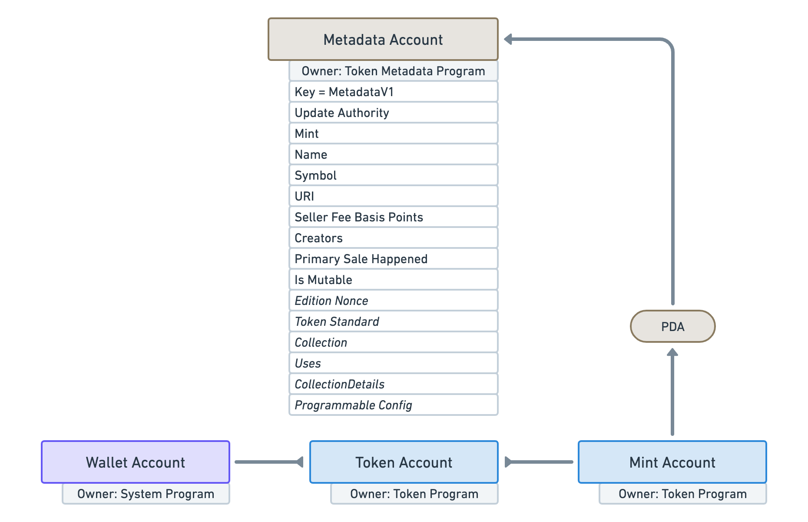
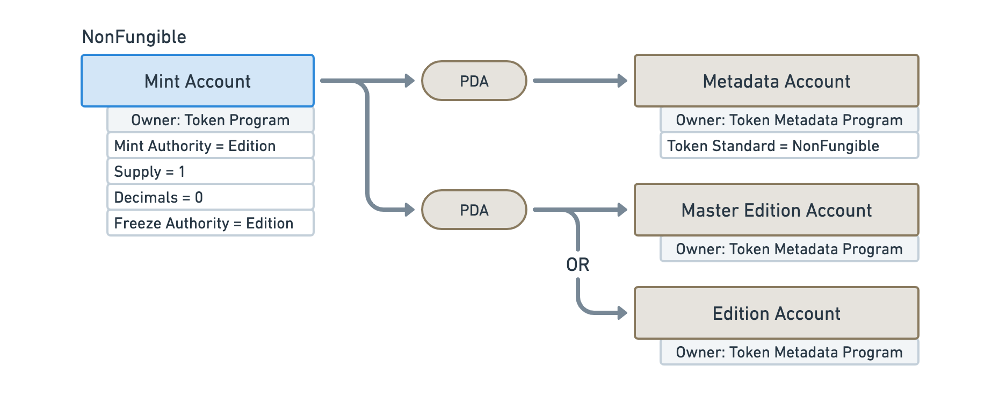

# [MIP-4] Decentralizing Token Metadata

## Overview

In this Metaplex Improvement Proposal (MIP), the Metaplex Foundation outlines a path to completing the Token Metadata program and making it immutable, in a way that ensures open and equal access for the ecosystem of creators, games and application developers that rely on it.

## Background

[Token Metadata](https://docs.metaplex.com/programs/token-metadata/) (TM) is the base layer program of the Metaplex protocol that manages the metadata and programmability of tokens. Today, all assets created with Metaplex start by first minting a token using the [Solana Token Program](https://spl.solana.com/token) (spl-token), securing the underlying record of ownership with an immutable program.

However, while a Mint Account created by spl-token contains a few key attributes such as the tokens current supply, it doesn't offer the ability to append standardized data that can be understood by apps, wallets and marketplaces. To address this, Metaplex’s Token Metadata program creates a Metadata Account that attaches itself to a Mint Account via a [PDA](https://solanacookbook.com/core-concepts/pdas.html).

In addition, when creating a Non-Fungible or NonFungibleEdition asset, the Token Metadata program retains freeze authority, which allows creators to program authorization rules that govern the transferability of a token. This is the core concept powering Programmable NFTs which can be used to enforce royalties.

## Path to Immutability

In its current construction, the Token Metadata program is upgradeable which is necessary to develop the core protocol software but also could allow for significant modifications to user assets, which falls short of Metaplex’s vision for a censorship resistant and permission-less digital asset economy.

In collaboration with the Solana Foundation, we propose that the terminal state of Token Metadata is immutability, meaning no entity can upgrade or modify the program or the assets it manages.

There are several reasons why Token Metadata cannot be made immutable immediately. For example:

1. The program is still in active development. Both programmable and compressed NFTs were introduced this year as incomplete primitives that interact directly with Token Metadata. In addition, there is a long list of community requests that need to be evaluated and prioritized before the program is complete.
2. Freezing Token Metadata immediately would prevent the Metaplex Foundation from fixing any security issues that weren’t previously discovered which could cause significant harm to the creators and communities that rely on the protocol. For context, the Metaplex Foundation has already paid close to $400,000 in external bug bounties and audits just for the Token Metadata program. If a critical defect is found after the upgrade authority was burned, there would be no ability to fix the program; doing so while there have been recent changes would be reckless.

Factoring in the time needed to complete development and ensure security of the program, the Metaplex Foundation is proposing an 18 month timeline to complete the program before it is transferred to a third party multisig of security auditors that will be mutually agreed upon by both the Metaplex Foundation and Solana Foundation.

The multisig handoff will be made to security firms who will perform an audit of the Token Metadata code and make security-based updates as necessary. The security firms will be contractually obligated to make Token Metadata immutable soon as reasonably practicable after completing the security audits and updates.

## Equal access

In the path to immutability, the Metaplex Foundation commits to preserving equal access to Token Metadata for all programs that call Token Metadata in order to create, update, transfer, burn, list, buy or sell NFTs.  This includes equal application of any fees that may be taken.

In addition, to ensure that Token Metadata can continue to serve as a reliable bedrock to the Solana NFT community, the Metaplex Foundation will not token gate functionality in Token Metadata with $MPLX before or after the program is made immutable.

## Open Liquidity

As stated in MIP-1, if the Metaplex Foundation builds an open liquidity layer to support programmable NFTs, the Metaplex Foundation commits to requiring it only for NFTs that migrated to pNFTs. Creators of newly minted NFTs and NFTs that did not migrate to pNFTs will be allowed to decide whether to use the open liquidity layer or not.

## Community Input

The Metaplex Foundation will work together with the community to finalize the feature set of Token Metadata before it is made immutable and will publish a separate MIP shortly with more detail on this process.